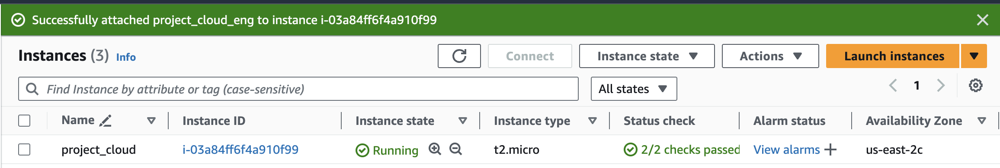
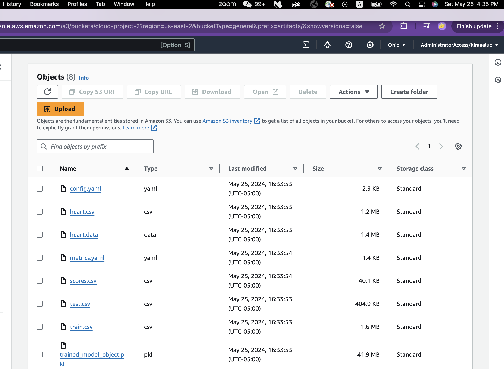
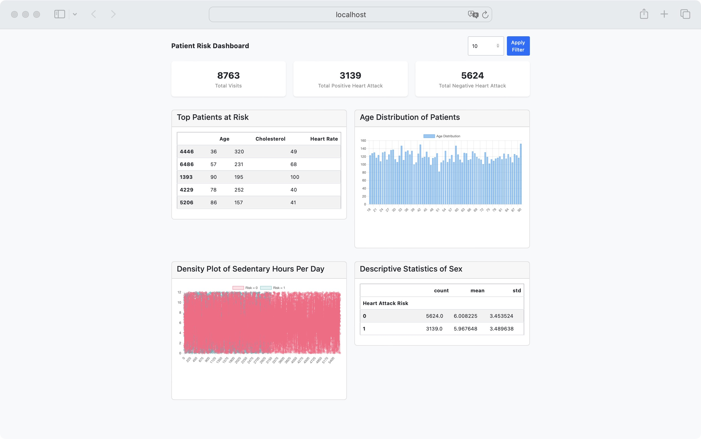

# Cloud Engineering Group Project
Team Member: Kira Luo, Jianyue Tian, Judy Zhu, Louise Liu, Sydney Li

## Planning
### Architecture Diagram
The architecture of the project is designed to leverage AWS services for efficient data handling and processing. The key components are:
- **Data Storage**: The raw data (Heart Attack Dataset from Kaggle in CSV format) is stored in an S3 Bucket.
  
- **Exploratory Analysis**: Amazon QuickSight is used for data visualization and exploratory analysis.
  
- **Data Processing and Machine Learning**:
  - **Loading Data from S3**: The data is loaded from the S3 bucket to the local machine for model training.
  - **Local Machine Training**: The model training process is conducted on a local machine.
  - **ETL and Code Pipeline**: An EC2 instance is used for running the ETL processes and managing the code pipeline.
  - **Model and Data Storage**: The trained model and related data are stored back into an S3 bucket.

- **Web Application**: A web application is developed to provide heart attack risk predictions


## Budgeting

### Cost Estimate

The estimated cost for running this project on AWS is broken down as follows:

- **Monthly Cost**: $22.83 USD
  - **Amazon S3**: $0.00 USD (minimal storage and data retrieval costs)
  - **Amazon QuickSight**: $18.60 USD (for data visualization and analysis)
  - **Amazon EC2**: $4.23 USD (for running ETL processes and code pipeline)

- **Total 12 Months Cost**: $273.96 USD


## Data Overview

### Crucial Factors Predicting Heart Attack Risk

The dataset includes several key features that help in predicting heart attack risk. These features are grouped into six main categories:

1. **Demographics and Geographic**
   - Age, Sex, Income, Country, Continent, Hemisphere

2. **Diagnosis**
   - Cholesterol, Blood Pressure, Heart Rate, Diabetes, Family History, Previous Heart Problems, BMI, Triglycerides, Medication Use

3. **Lifestyle Choices**
   - Smoking, Obesity, Alcohol Consumption, Diet

4. **Activity and Exercise**
   - Exercise Hours Per Week, Physical Activity Days Per Week, Sedentary Hours Per Day

5. **Well-being**
   - Stress Level, Sleep Hours Per Day

6. **Heart Attack Risk**
   - Heart Attack Risk (target variable)
  


### Data Preparation

These features are carefully preprocessed, including handling missing values, normalizing data, encoding categorical variables, and feature engineering, to build an effective machine learning model for heart attack prediction.


## Model Building and Training
1. Data preprocessing: data cleaning, feature engineering (feature selection, standardize numerical features and one hot encoding for categorical features)

2. Deal with unbalanced data using SMOTE: generate new samples in the minority class (class 1 with higher risk)

3. Model training:

    * Train/test set split with 0.8 ratio

    * Hyperparameter tuning based on grid search cross-validation of 5 folders

    * Best hyperparameters: {'max_depth': 40, 'max_features': 5, 'min_samples_leaf': 4 'n_estimators': 400}

## Configration and others...

* Configuration Files: pull out all necessary configurations into default-config.yaml

* Logging: 3 distinct levels of logging used, using standard naming convention, etc…

* Enable the reproducible execution of each step of the mode development:

    * Get raw data from s3 —> modeling —-> save artifacts to S3 in another bucket

    * Split pipeline.py into 8 modular functions in .py files

    * Artifacts are properly saved at each step

* Unit Testing:
happy path and unhappy path (ensure only numeric values are supplied to StandardScaler)

* Pylint Evaluation: 10/10 for all .py files (pylint --rcfile=.pylintrc [files.py] )

* Type Hints, Docstrings, Requirement.txt, Exception Handling, and NO Hard-coding: they are used appropriately throughout application

* Docker command:
```
docker build -t pipeline -f dockerfiles/Dockerfile .

docker run -v ${HOME}/.aws/:/root/.aws/:ro -v "$(pwd)/runs:/app/artifacts" -e AWS_PROFILE=cloud-project pipeline

docker build -t test-pipeline -f dockerfiles/Dockerfile_test .

docker run test-pipeline
```

## Model Deployment on AWS
1. I have been securely connected to AWS EC2 instances


2. Clone My Repository

Next I securely link my github via creating SSH keys. I am going clone it directly to my EC2 instance:

```{bash}
sudo yum update -y
sudo yum install git -y
sudo yum install python3 -y
```

```{bash}
git clone git@github.com:KiraaaaLuo/Cloud_Eng_Project.git
cd Cloud_Eng_Project
```

3. Set Up Python Environment and Manage dependencies

```{bash}
python3 -m venv myenv
source myenv/bin/activate
pip install -r requirements.txt
```

4. run the pipeline

basically the command line shows that:
```{bash}
(myenv) [ec2-user@ip-172-31-38-107 Cloud_Eng_Project]$ python pipeline.py
```
This confirms that I am indeed running commands on your EC2 instance. Then I run the pipeline file as the following:

```{bash}
python pipeline.py
```


I got my expected output and have checked that everything has been uploaded as artifacts successfully



## Web Application on Flask

1. run docker

```{bash}
docker build -t cloud_project_web -f dockerfiles/Dockerfile_webapp .
```

```{bash}
docker run -p 5001:5000 cloud_project_web
```

2. check application on your local port 5001 


